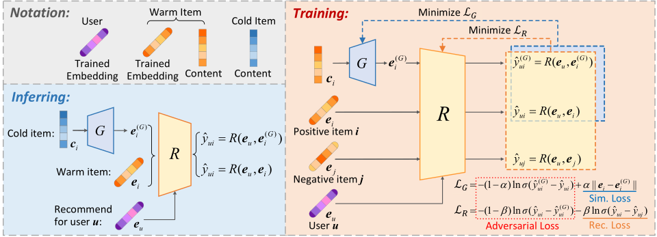

# GAR - Generative Adversarial Framework for Cold-Start Item Recommendation


## Usage

1. Prepare `tensorflow-1.15` environment. 

2. Go to the root directory and run **GAR** through
   
      ```
     python main.py --dataset CiteULike --model gar
      ```
      
## Experiments

1. **Experiment setup**. We first split the items in the raw data into warm items and cold items with the ratio 8:2. The warm items make up the warm set with the related historical interactions. And so does the cold items. The warm set is further split into four subsets for embedding model training, cold-start model training, validation (of warm recommendation performance) and testing with the ratio 65%:15%:10%:10%. The cold set is further split into two subsets for validation (of warm recommendation performance) and testing with the ratio 1:1.
The statistics of *CiteULike* and *XING* are provided below.

    

2. **Experimental results**. As shown in the paper, the recommendation performance of our model and the baselines is shown as follows.

    

3. **Additional experiment**. We also evaluate the models in another setting where the warm set mentioned above is split into three subsets for embedding model/cold-start model training, validation and testing with the ratio 8:1:1. That is to say, the embeddings model and the cold-start model are trained with the same data. This setting is widely used in both research and industry. To validate the generality of our model, we add this part of experiment results here. We recommend this setting to evaluate your cold-start model.
    
     

## Citation 
```
@inproceedings{10.1145/3477495.3531897,
	author = {Chen, Hao and Wang, Zefan and Huang, Feiran and Huang, Xiao and Xu, Yue and Lin, Yishi and He, Peng and Li, Zhoujun},
	title = {Generative Adversarial Framework for Cold-Start Item Recommendation},
	year = {2022},
	isbn = {9781450387323},
	publisher = {Association for Computing Machinery},
	address = {New York, NY, USA},
	url = {https://doi.org/10.1145/3477495.3531897},
	doi = {10.1145/3477495.3531897},
	booktitle = {Proceedings of the 45th International ACM SIGIR Conference on Research and Development in Information Retrieval},
	pages = {2565–2571},
	numpages = {7},
	keywords = {adversarial framework, cold-start recommendation, recommender system},
	location = {Madrid, Spain},
	series = {SIGIR '22}
}
```